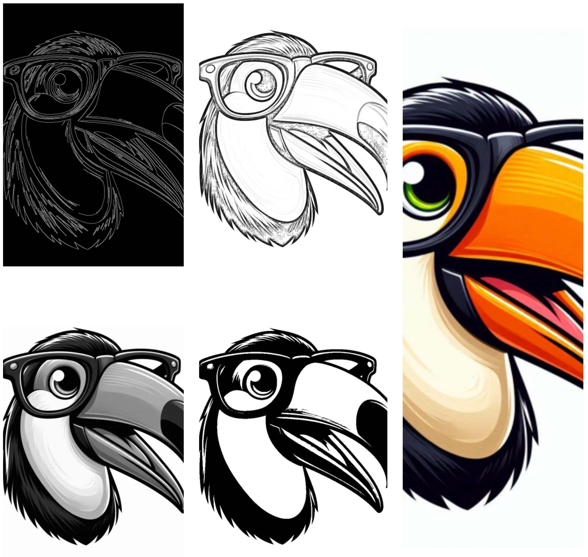

# Tracify




Tracify is a Python-based GUI application designed for transforming images into creative outputs such as sketch effects, contour outlines, and tattoo templates. Built with \`PyQt5\`, it offers a user-friendly interface to process and save images effortlessly.

## Features

- **Sketch Effect**: Converts images into sketch-like drawings with darker lines and lighter shading for a realistic pencil effect.
- **Contour Effect**: Highlights edges and contours in the image, making it ideal for tracing or technical use.
- **Tattoo Template (Calc)**: Creates high-contrast binary images for easy application on skin or as stencils for tattoos.
- **Grayscale Conversion**: Quickly converts images to grayscale.

## Technologies Used

- **Python 3.11**
- **PyQt5**: For building a responsive graphical user interface.
- **OpenCV**: For advanced image processing tasks.
- **pytest-qt**: For unit and GUI testing.

## Installation

1. Clone the repository:
   ```bash
   git clone https://github.com/draprar/Tracify.git
   cd Tracify
   ```

2. Install dependencies:
   ```bash
   pip install -r requirements.txt
   ```

3. Run the application:
   ```bash
   python main.py
   ```

## How to Use

1. **Load an Image**:
   - Click the "Load Image" button and select a file from your system.

2. **Apply Effects**:
   - Choose an effect from the dropdown menu.
   - Click "Apply Effect" to process the image.

3. **Save the Result**:
   - After applying an effect, click "Save Image" to store the processed image on your computer.

## Testing

The application includes automated tests for key functionalities:
- Mocked image loading, effect application, and file saving.
- GUI interaction tests using `pytest` and `pytest-qt`.

To run the tests:
    ```
    python pytest
    ```

## Contributing

Contributions are welcome! If you’d like to add new features, fix bugs, or improve the code, please:
1. Fork the repository.
2. Create a new branch for your feature or fix.
3. Submit a pull request with a detailed description of your changes.

## **Credits**

- **Developer**: Walery ([@draprar](https://github.com/draprar/))
- **Image Processing Techniques**: Powered by OpenCV for enhanced performance and flexibility.

---

*Tracify – Transform your images, unleash your creativity!*